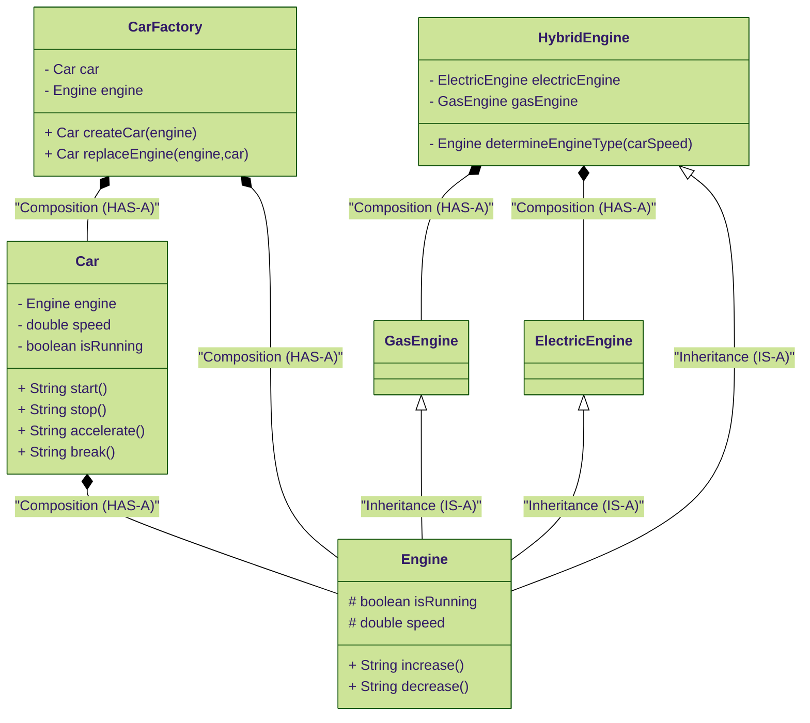

### System Architecture Diagram

```mermaid
---
config:
  theme: forest
---
classDiagram
    class Car {
        - Engine engine
        - double speed
        - boolean isRunning
        + String start()
        + String stop()
        + String accelerate()
        + String break()

    }

    class Engine {
        # boolean isRunning
        # double speed
        + String increase()
        + String decrease()
    }
    class ElectricEngine {
    }
    class GasEngine {
    }
    class HybridEngine {
        - ElectricEngine electricEngine
        - GasEngine gasEngine
        - Engine determineEngineType(carSpeed)
    }

    class CarFactory {
        - Car car
        - Engine engine
        + Car createCar(engine)
        + Car replaceEngine(engine,car)
    }

    

    Car *-- Engine : "Composition (HAS-A)"
    CarFactory *-- Car : "Composition (HAS-A)"
    CarFactory *-- Engine : "Composition (HAS-A)"
    HybridEngine *-- ElectricEngine : "Composition (HAS-A)"
    HybridEngine *-- GasEngine : "Composition (HAS-A)"
    GasEngine <|-- Engine : "Inheritance (IS-A)"
    ElectricEngine <|-- Engine : "Inheritance (IS-A)"
    HybridEngine <|-- Engine : "Inheritance (IS-A)"
```
