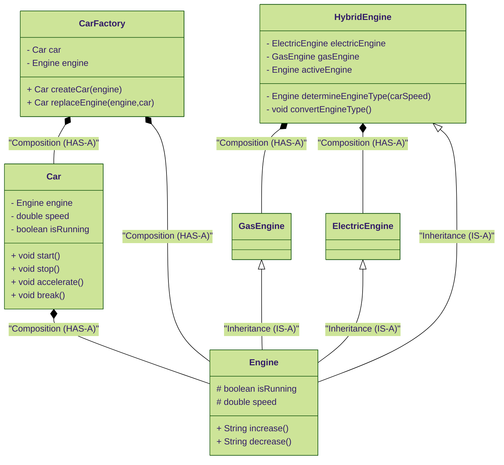

### System Architecture Diagram

```mermaid
---
config:
  theme: forest
---
classDiagram
direction TB
    class Car {
	    - Engine engine
	    - double speed
	    - boolean isRunning
	    + void start()
	    + void stop()
	    + void accelerate()
	    + void break()
    }

    class Engine {
	    # boolean isRunning
	    # double speed
	    + String increase()
	    + String decrease()
    }

    class ElectricEngine {
    }

    class GasEngine {
    }

    class CarFactory {
	    - Car car
	    - Engine engine
	    + Car createCar(engine)
	    + Car replaceEngine(engine,car)
    }

    class HybridEngine {
	 
        - ElectricEngine electricEngine
	    - GasEngine gasEngine
        - Engine activeEngine
	    - Engine determineEngineType(carSpeed)
        - void convertEngineType()
    }

    Car *-- Engine : "Composition (HAS-A)"
    CarFactory *-- Car : "Composition (HAS-A)"
    CarFactory *-- Engine : "Composition (HAS-A)"
    HybridEngine *-- ElectricEngine : "Composition (HAS-A)"
    HybridEngine *-- GasEngine : "Composition (HAS-A)"
    GasEngine <|-- Engine : "Inheritance (IS-A)"
    ElectricEngine <|-- Engine : "Inheritance (IS-A)"
    HybridEngine <|-- Engine : "Inheritance (IS-A)"
```
